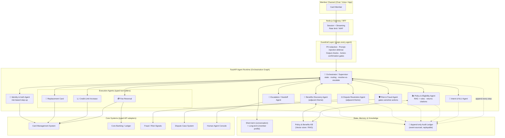

# End-to-End Servicing Agent — Multi-Agent System Architecture

> **Context:** American Express **CodeStreet 2026** (HackerEarth) — theme **"End-to-End Servicing Agent."**
> Build a conversational agent that fully resolves high-frequency card-service requests
> (**fee reversals, credit-limit increases, replacement-card orders**) in a **single interaction**,
> keeps a **verifiable audit trail** of every decision and action, and **hands off to a human with
> complete context** when escalation is needed.
>
> This design deliberately makes the servicing agent a *superset* that also absorbs two adjacent
> CodeStreet themes that live naturally inside a servicing conversation — **Dispute Resolution**
> (weeks → minutes) and **Benefits Discovery** (unused insurance/protection benefits) — with
> **fraud/risk gating** as a cross-cutting guard. One build, three problem statements.

---

## 1. Design principles

1. **LLM agents decide; typed tools act.** Reasoning is done by LLM agents, but every state-changing
   effect (reverse a fee, raise a limit, order a card, open a dispute) goes through a **typed,
   idempotent tool** with an idempotency key — never free-form model output. This keeps actions
   auditable, reversible, and safe.
2. **Single interaction, full resolution.** The orchestrator is optimized to close the request in one
   conversation; escalation is an explicit, well-instrumented exit — not a dead end.
3. **Audit-by-construction.** Every intent, policy decision, citation, tool call, and outcome is
   appended to an immutable event log as it happens, so the trail is a byproduct of running, not an
   afterthought.
4. **Human-in-the-loop is first-class.** When confidence is low, policy denies, risk is high, or the
   request is out of scope, the agent packages complete context and hands off — the member never
   re-explains.
5. **Reuse the shell.** Identity, memory, audit, and handoff plumbing are built once and shared by
   every capability, which is exactly why adjacent themes plug in cheaply.

---

## 2. System architecture

---

## 3. Agent roster

| Agent | Responsibility | Key tools / data |
|---|---|---|
| **Orchestrator / Supervisor** | Owns conversation state; routes to sub-agents; decides resolve-vs-escalate; enforces "single interaction" goal. | Memory, all sub-agents |
| **Intent & NLU** | Classifies request type; extracts slots (amount, card, reason); detects **multi-intent** (e.g. "reverse this fee *and* I don't recognize this charge"). | — |
| **Identity & Auth** | Risk-based verification and **step-up auth** before any sensitive action. | Card Management System |
| **Policy & Eligibility** | RAG over policy KB + business rules: is this fee reversible? CLI eligible? replacement allowed? Returns a decision **with citations**. | Policy KB (RAG) |
| **Fee Reversal** *(execution)* | Reverses eligible fees via typed API with confirmation + idempotency key. | CMS, Core Banking |
| **Credit-Limit Increase** *(execution)* | Runs eligibility + executes limit change. | CMS |
| **Replacement Card** *(execution)* | Orders replacement/reissue; verifies shipping. | CMS |
| **Dispute Resolution** *(adjacent theme)* | Collects transaction evidence, evaluates merchant vs. customer perspective, drafts a **transparent, reason-coded outcome**, opens a case. Compresses weeks → minutes. | Dispute Case System |
| **Benefits Discovery** *(adjacent theme)* | Matches recent purchases against the member's card benefit catalog to surface **unused purchase protection / insurance / claim** options. | Benefits KB (RAG) |
| **Risk & Fraud** *(cross-cutting guard)* | Gates every sensitive action (esp. replacement card + CLI) with a fraud/risk signal **before** execution. | Fraud signals |
| **Escalation / Handoff** | Packages transcript, decisions, citations, and a human-readable summary into a case so a human resumes with zero re-explaining. | Human Console |
| **Audit & Compliance** *(layer)* | Append-only event log — every intent, decision, citation, tool call, outcome — immutable and replayable. | Audit Ledger |
| **Guardrail** *(layer)* | PII redaction, prompt-injection defense, output/hallucination checks, action-confirmation gates. Wraps all agents. | — |

---

## 4. Request lifecycle

**Happy path (e.g. fee reversal):**

1. Member message enters via the Node.js gateway → **Guardrails** sanitize/redact.
2. **Intent & NLU** classifies "fee reversal" and extracts the fee/transaction + reason.
3. **Identity & Auth** verifies the member; steps up auth if the action is sensitive.
4. **Policy & Eligibility** checks reversal rules via RAG and returns *eligible* **with citations**.
5. **Risk & Fraud** clears the action.
6. **Fee Reversal Execution Agent** calls the typed, idempotent reversal tool; confirms to the member.
7. **Benefits Discovery** opportunistically surfaces any relevant unused benefit.
8. Every step is appended to the **Audit Ledger** as it happens.

**Branches:**
- **Multi-intent** — "reverse this fee, and I don't recognize this charge" → orchestrator resolves the
  fee *and* routes the charge into the **Dispute Resolution Agent** in the same conversation.
- **Escalate** — low confidence / policy denial / high risk / out-of-scope → **Escalation Agent**
  packages full context → **Human Console**.

---

## 5. Verifiable audit trail

- **Event-sourced, append-only ledger.** Each record: `{ timestamp, actor (agent), event_type,
  inputs, decision, policy_citations, tool_call + idempotency_key, outcome, confidence }`.
- **Replayable.** The full decision path for any request can be reconstructed and independently
  verified — satisfying the "verifiable audit trail of every decision and action" requirement.
- **Tamper-evident.** Records are immutable (optionally hash-chained) so the trail can be trusted for
  compliance review.

---

## 6. Why the adjacent themes integrate (the pitch)

The conversational shell already holds **identity, context, memory, audit, and handoff** plumbing.
Dispute Resolution and Benefits Discovery reuse the *same* orchestrator, auth, audit, and escalation
machinery — they are additional Execution/Advisory agents, **not separate products**. A member rarely
thinks in "problem statements": a servicing conversation *is* where disputes get raised and where
unused benefits are most relevant. Owning the conversation means one build ≈ **three CodeStreet
themes**.

---

## 7. Tech-stack mapping (Node.js / FastAPI)

- **FastAPI** hosts the agent runtime — the orchestration graph, LLM tool-calling, and RAG retrieval.
- **Node.js gateway / BFF** handles the chat surface (streaming), sessions, rate limiting, and typed
  API adapters to core systems.
- **Orchestration:** a graph / state-machine style agent framework (vendor-neutral) for supervisor →
  sub-agent routing with explicit human-in-the-loop nodes.
- **RAG:** a vector store over policy + benefit documents for the Policy and Benefits agents.
- **Audit ledger:** an append-only store (event-sourcing); optionally hash-chained for tamper-evidence.
- **LLM:** a capable frontier model for reasoning agents; smaller/faster models for classification and
  guardrail checks.

---

## 8. Evaluation (how to prove it works)

- **Resolution rate** — % of requests fully closed in a single interaction (no human).
- **Correct escalation** — % of cases that *should* escalate that do, with complete context.
- **Action safety** — zero unauthorized/duplicate state changes (idempotency + confirmation gates).
- **Audit completeness** — every action reconstructable from the ledger (100% coverage).
- **Dispute cycle time** — median time from raise → transparent outcome (target: minutes).
- **Benefits lift** — unused benefits surfaced / claimed per servicing conversation.

---

### Sources
- HackerEarth — CodeStreet 2026: <https://www.hackerearth.com/challenges/hackathon/codestreet-2026/>
- Overview — talentd.in: <https://www.talentd.in/articles/american-express-codestreet-2026-hackathon>
- Problem statement ("End-to-End Servicing Agent") screenshot supplied by the entrant.
