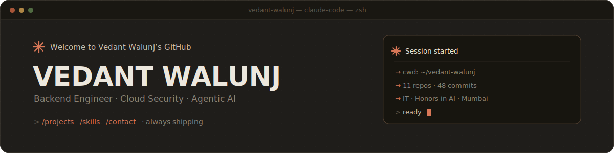
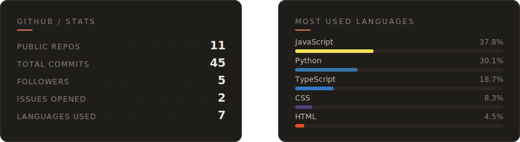
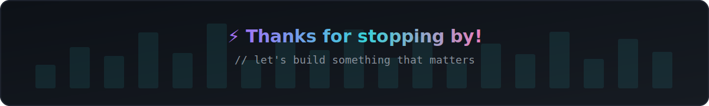

<!-- ============ HERO BANNER ============ -->

<h1 align="center">Namaste 🙏 I'm Vedant Walunj</h1>

  IT engineering student at <b>KJ Somaiya College of Engineering</b> (Honors in AI), building
  <b>backend systems, cloud-security automation, and agentic AI</b>. Currently a Technical Intern
  on the DevOps team at <b>ARCON</b>, automating CVE remediation and AWS security auditing —
  and always shipping something new.

  
  
  

---

## 🧑‍💻 About Me

- 🔭 I build **backend systems, cloud-security tooling, and agentic AI** platforms.
- ☁️ Currently deep in **AWS security automation** — CloudTrail auditing & CVE remediation — at ARCON.
- 🧰 Full-stack comfortable: REST APIs, SQL & NoSQL databases, DevOps pipelines, and React dashboards.
- 🌱 Always leveling up — exploring distributed systems, infrastructure, and DSA in `C++`.
- 🏆 2× national hackathon finalist · 💬 Ask me about **Python, TypeScript, agentic AI, or cloud security**.

## 🔗 Connect With Me

  
  
  
  
  

---

## 📊 GitHub Stats

## 🛠️ Languages & Tools I've Worked With

   
   
   
  

## 🧩 Tech Stack

  
  
  
  
  
  
   
  
  
  
  
  
  

---

## 📌 Featured Repositories

<table>
  <tr>
    <td width="50%" valign="top">
      <h3>🌐 <a href="https://github.com/vedant1317/vedant-walunj-portfolio">Portfolio</a></h3>
      MERN-stack personal portfolio with live GitHub / LeetCode / Letterboxd feeds and a self-hosted profile card.
        
      
      
      
    </td>
    <td width="50%" valign="top">
      <h3>🏎️ <a href="https://github.com/vedant1317/CC-Project">CC-Project</a></h3>
      Automated database-evaluation suite for cloud-native apps — benchmarks PostgreSQL, MongoDB & DynamoDB.
        
      
      
    </td>
  </tr>
  <tr>
    <td width="50%" valign="top">
      <h3>🛡️ <a href="https://github.com/vedant1317/VAPT-Project">VAPT-Project</a></h3>
      Vulnerability assessment & penetration-testing toolkit — automating security scans and reporting.
        
      
      
    </td>
    <td width="50%" valign="top">
      <h3>🧬 <a href="https://github.com/vedant1317/MolecularGNN">MolecularGNN</a></h3>
      Graph neural network for molecular property prediction — deep learning on chemical structures.
        
      
      
    </td>
  </tr>
</table>

---

